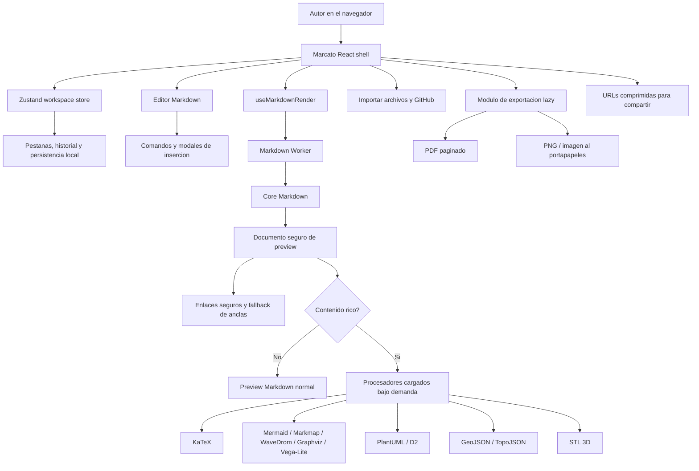

# Marcato

**Un estudio Markdown refinado para escribir, previsualizar, diagramar, compartir y exportar.**

[English](README.md) | [简体中文](README.zh-CN.md) | [Español](README.es.md)

[](https://vercel.com/new/clone?repository-url=https%3A%2F%2Fgithub.com%2Ftianrking%2FMarcato&project-name=marcato&repository-name=Marcato)


Marcato nace inspirado por [`Markdown-Viewer`](https://github.com/ThisIs-Developer/Markdown-Viewer): conserva la idea de abrir el navegador, escribir Markdown y ver el resultado al instante, pero la lleva a una arquitectura moderna con React, renderizado en Worker, diagramas ricos, PDF verificado, enlaces compartibles, importación desde GitHub y pruebas reproducibles.

## Stack tecnico

<table>
  <tr>
    <td><strong>Interfaz</strong><br/>React 19, TypeScript, Zustand, lucide-react</td>
    <td><strong>Build</strong><br/>Vite 8, PWA, salida estatica lista para Vercel</td>
    <td><strong>Markdown</strong><br/>marked, DOMPurify, highlight.js, GitHub Markdown CSS</td>
  </tr>
  <tr>
    <td><strong>Matematicas</strong><br/>KaTeX</td>
    <td><strong>Diagramas</strong><br/>Mermaid, Markmap, WaveDrom, Graphviz, Vega-Lite, PlantUML, D2</td>
    <td><strong>Mapas / 3D</strong><br/>Leaflet, TopoJSON, Three.js, STL loader</td>
  </tr>
  <tr>
    <td><strong>Exportacion</strong><br/>PDF, PNG, HTML, Markdown, imagen al portapapeles</td>
    <td><strong>Compartir</strong><br/>URLs view/edit comprimidas con pako</td>
    <td><strong>Verificacion</strong><br/>Playwright para smoke, PDF, rendimiento y diagramas</td>
  </tr>
</table>

## Arquitectura



## Funciones

- Workspace Markdown con multiples pestanas, persistencia local, renombrar, duplicar, cerrar, reset y undo/redo por pestana.
- Modos editor, split y preview con panel redimensionable, numeros de linea, estadisticas, indice, diagnostico del documento y scroll sincronizado.
- Renderizado Markdown en Worker con GFM, frontmatter, notas al pie, listas de definicion, super/subindice, resaltado, GitHub alerts y HTML sanitizado.
- KaTeX, Mermaid, ABC, GeoJSON/TopoJSON, Graphviz, Vega-Lite, Markmap, WaveDrom, PlantUML, D2 y STL.
- Buscar/reemplazar con regex, mayusculas, palabra completa, seleccion, resaltado en preview y confirmacion.
- Modales para enlaces, imagenes, referencias, tablas, alertas, simbolos y GitHub Emoji.
- Importacion local, drag and drop, importacion de Markdown desde repositorios, arboles, blobs y raw URLs de GitHub.
- Exportacion a Markdown, HTML, PNG, imagen al portapapeles y PDF paginado cancelable.
- URLs comprimidas para compartir en modo solo lectura o editable.
- PWA app shell con precache ligero y service worker facil de actualizar.

## Verificacion

```bash
npm install
npm run lint
npm run build
npm test
```

Suites disponibles:

- `test:smoke`: editor, preview, modales, busqueda, compartir y shell movil.
- `test:pdf`: tablas largas, saltos de pagina, diagramas, matematicas, progreso y cancelacion.
- `test:perf`: documentos grandes y prueba de carga bajo demanda para renderizado rico.
- `test:diagrams`: Markmap/WaveDrom locales, PlantUML/D2 remotos, normalizacion, retry y sanitizacion SVG.

## Deploy

Marcato es una app 100% cliente y se puede desplegar directamente en Vercel con el boton superior. `vercel.json` fija Node 20 y mantiene `sw.js` / Workbox con `Cache-Control: no-cache` para que las actualizaciones PWA lleguen sin friccion.

## Homenaje

Marcato rinde homenaje a [`Markdown-Viewer`](https://github.com/ThisIs-Developer/Markdown-Viewer). Ese proyecto mostro que un visor Markdown enfocado y directo en el navegador puede ser muy valioso. Marcato continua esa idea con React, pruebas, mejor rendimiento, exportacion mas fuerte y un flujo de producto mas completo.
