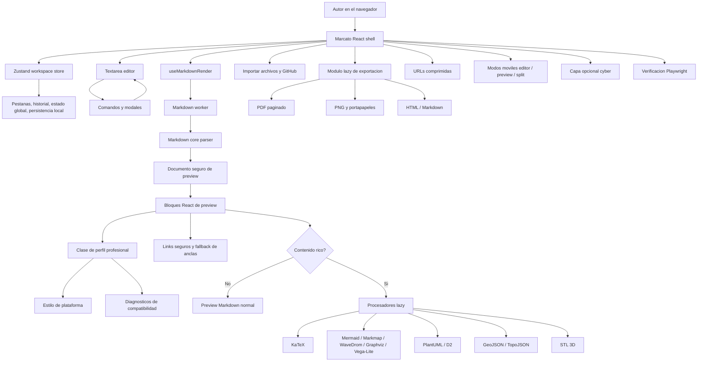

# Marcato

**Un estudio Markdown refinado, pensado para el navegador: escritura, perfiles profesionales de vista previa, diagramas, compartir, exportar y flujos moviles.**

[English](README.md) | [简体中文](README.zh-CN.md) | [Espanol](README.es.md)

[](https://vercel.com/new/clone?repository-url=https%3A%2F%2Fgithub.com%2Ftianrking%2FMarcato&project-name=marcato&repository-name=Marcato)


Marcato esta inspirado por [`Markdown-Viewer`](https://github.com/ThisIs-Developer/Markdown-Viewer). Conserva la idea de escribir Markdown en el navegador y verlo al instante, y la expande con una arquitectura React moderna: renderizado en Worker, diagramas ricos, perfiles profesionales de publicacion, exportacion verificada, enlaces compartibles, importacion desde GitHub, modos moviles y pruebas reproducibles.

## Capturas

| Perfil profesional WeChat | Perfil Docusaurus |
| --- | --- |
|  |  |

| Preview movil | Split movil | Efectos cyber |
| --- | --- | --- |
|  |  |  |

## Que hace Marcato

<table>
  <tr>
    <td><strong>Escritura</strong><br/>Editor Markdown con pestanas, historial undo/redo, numeros de linea, Enter inteligente, comandos y modales de insercion.</td>
    <td><strong>Preview</strong><br/>GFM en Worker con matematicas, diagramas, HTML sanitizado, resaltado de busqueda, indice y scroll sincronizado.</td>
    <td><strong>Publicacion</strong><br/>Perfiles para WeChat, GitHub, Docusaurus, VitePress, MkDocs, Hugo, Jekyll y Astro.</td>
  </tr>
  <tr>
    <td><strong>Importar</strong><br/>Archivos locales, drag and drop, validacion de binarios/tamano, importacion GitHub repo/tree/blob/raw.</td>
    <td><strong>Exportar</strong><br/>Markdown, HTML, PNG, imagen al portapapeles y PDF paginado cancelable.</td>
    <td><strong>Compartir</strong><br/>URLs comprimidas en modo solo lectura o editable, generadas desde el origen actual.</td>
  </tr>
  <tr>
    <td><strong>Movil</strong><br/>Editor a pagina completa, preview a pagina completa y split vertical.</td>
    <td><strong>Estilo</strong><br/>Tema claro/oscuro, paletas de color, enlace a GitHub y efectos cyber opcionales.</td>
    <td><strong>Confianza</strong><br/>Unit tests y suites Playwright para smoke, PDF, rendimiento, diagramas y layout movil.</td>
  </tr>
</table>

## Modos

### Modos de workspace

| Modo | Escritorio | Movil |
| --- | --- | --- |
| Editor | El editor ocupa todo el workspace. | El editor ocupa toda el area de la app, sin media pantalla vacia. |
| Split | Editor y preview lado a lado con divisor redimensionable. | Editor y preview en vertical para comparar rapido. |
| Preview | La vista previa ocupa todo el workspace. | La vista previa se comporta como una pagina de lectura. |

### Perfiles profesionales

Professional Mode no es un interruptor vacio. Cambia la clase del preview, aplica estilo orientado a plataforma, persiste la seleccion y ejecuta diagnosticos de compatibilidad.

| Perfil | Escenario | Comprobaciones actuales |
| --- | --- | --- |
| Standard | Vista completa de Marcato. | Sin restricciones de plataforma. |
| WeChat Official Account | Articulos rich-text para WeChat. | Frontmatter, matematicas, tablas, footnotes, HTML, imagenes remotas, diagramas, longitud. |
| GitHub Markdown | README, issues, discussions y pull requests. | Fences ricos de Marcato, sintaxis Docusaurus/MkDocs, frontmatter visible, referencias. |
| Docusaurus / MDX | Documentacion y MDX. | Frontmatter, admonitions `:::`, script/style, links internos `.md`. |
| VitePress | Documentacion Vue. | Contenedores, frontmatter, links internos, incompatibilidad JSX/React. |
| Material for MkDocs | Documentacion Python/Material. | Admonitions `!!!`, JSX/Vue no soportado, metadata. |
| Hugo / Goldmark | Blogs y paginas de contenido. | Frontmatter, raw HTML, shortcodes, contenedores externos. |
| Jekyll / GitHub Pages | Posts y paginas de GitHub Pages. | YAML frontmatter, Liquid vs shortcode, admonitions externas. |
| Astro / Starlight | Content collections y MDX. | Frontmatter, imagenes locales, componentes MDX, shortcodes no compatibles. |

### Modos visuales

- Tema claro y oscuro.
- Paletas de acento: blue, teal, violet, rose, amber.
- Cyber Effects opcional: lluvia tipo matrix, scan beam, particulas, pulsos electricos, glow del puntero y una pequena mascota pixel-art.
- Respeta `prefers-reduced-motion`: la capa de efectos se oculta cuando el sistema pide menos movimiento.

## Markdown y bloques ricos

| Area | Soporte |
| --- | --- |
| Markdown base | Tablas GFM, task lists, strikethrough, autolinks, frontmatter table, footnotes, definition lists, sup/sub, highlights, GitHub alerts. |
| Codigo | highlight.js core con lenguajes comunes: JS/TS, Python, Rust, Go, Java, C/C++, C#, SQL, Bash, PowerShell, YAML, JSON, XML/HTML, CSS, PHP, Ruby, diff, Markdown. |
| Matematicas | KaTeX inline y block. |
| Diagramas | Mermaid, ABC notation, GeoJSON, TopoJSON, STL, PlantUML, D2, Graphviz/DOT, Vega-Lite, WaveDrom, Markmap. |
| Acciones de diagramas | Copiar/descargar SVG o PNG cuando aplica, zoom, sanitizacion SVG y fallback de portapapeles. |
| Seguridad | DOMPurify para HTML Markdown, links externos seguros, sanitizacion SVG y descarga fallback si falla el portapapeles. |

## Herramientas de edicion

- Bold, italic, strike, H1-H6, quote, listas, task list, horizontal rule.
- Inline code, code block, terminal block, matematicas, fecha/hora, uppercase/lowercase/title case.
- Modales para link, imagen, referencia, tabla, alert, simbolos/HTML entities, emoji y plantillas de diagramas.
- Buscar/reemplazar con regex, mayusculas, palabra completa, seleccion, preservar caso, historial, resaltado en preview y confirmacion diff para replace all.
- Health score del documento, modal de detalles y salto a linea.

## Importar, exportar, compartir

| Flujo | Detalles |
| --- | --- |
| Importacion local | `.md`, `.markdown`, `.txt`; drag and drop; deteccion binaria; limite 10 MB. |
| Importacion GitHub | Repository, tree, blob y raw URL con seleccion de archivos Markdown. |
| Exportacion | Markdown, HTML, PNG, PNG al portapapeles y PDF paginado. |
| PDF | UI de progreso, cancelacion, page breaks, tablas y pruebas con rich preview. |
| Compartir | URL `#share=` comprimida con pako; solo lectura/editable; aviso de URL larga; usa el origen actual. |
| PWA | App shell estatica, Workbox service worker y no-cache para actualizaciones confiables. |

## Arquitectura



## Stack tecnico

<table>
  <tr>
    <td><strong>UI</strong><br/>React 19, TypeScript, Zustand, lucide-react</td>
    <td><strong>Build</strong><br/>Vite 8, salida estatica Vercel, PWA service worker</td>
    <td><strong>Markdown</strong><br/>marked, DOMPurify, highlight.js, GitHub Markdown CSS</td>
  </tr>
  <tr>
    <td><strong>Matematicas</strong><br/>KaTeX</td>
    <td><strong>Diagramas</strong><br/>Mermaid, Markmap, WaveDrom, Graphviz, Vega-Lite, PlantUML, D2, ABC</td>
    <td><strong>Mapas / 3D</strong><br/>Leaflet, TopoJSON, Three.js, STL loader</td>
  </tr>
  <tr>
    <td><strong>Exportacion</strong><br/>jsPDF, html2canvas, file-saver, Clipboard APIs</td>
    <td><strong>Compartir</strong><br/>URLs comprimidas con pako</td>
    <td><strong>Verificacion</strong><br/>Playwright, TypeScript, oxlint</td>
  </tr>
</table>

## Verificacion

```bash
npm install
npm run lint
npm run build
npm test
```

Suites reutilizables en `tests/e2e`:

- `npm run test:smoke`: editor, preview, modales, buscar/reemplazar, share URLs, shell movil y modos moviles.
- `npm run test:pdf`: tablas largas, page breaks, diagramas, matematicas, progreso y cancelacion.
- `npm run test:perf`: documentos grandes y prueba de lazy loading para rich preview.
- `npm run test:diagrams`: Markmap, WaveDrom, PlantUML, D2, retry y sanitizacion SVG.

Las capturas seleccionadas para el README vienen de verificaciones del navegador y viven en `test-artifacts/`. Logs temporales y reportes JSON siguen ignorados.

## Desarrollo

```bash
npm run dev -- --host 127.0.0.1 --port 5173
```

Build de produccion:

```bash
npm run build
npm run preview
```

## Deploy

Marcato es una app cliente y se puede desplegar directamente en Vercel con el boton superior. `vercel.json` fija Node 20 y mantiene `sw.js` / Workbox con `Cache-Control: no-cache`.

Solo necesita red para importacion GitHub, servicios remotos de diagramas, tiles de mapas externos o imagenes externas referenciadas por el documento. La escritura y el preview local permanecen en el navegador.

## Limites actuales

Los perfiles profesionales ya ofrecen estilo de preview y diagnosticos por plataforma. Todavia no compilan todos los dialectos a la salida nativa de cada ecosistema. Los siguientes adaptadores de mayor valor son: copia rich-text para WeChat con estilos inline, render real de admonitions `:::` para Docusaurus/VitePress y render `!!!` para Material for MkDocs.

## Homenaje

Marcato rinde homenaje a [`Markdown-Viewer`](https://github.com/ThisIs-Developer/Markdown-Viewer). Ese proyecto demostro que un viewer Markdown enfocado y directo en el navegador puede ser muy valioso. Marcato continua esa idea con React moderno, pruebas, mejor exportacion, perfiles profesionales y un flujo de producto mas completo.
