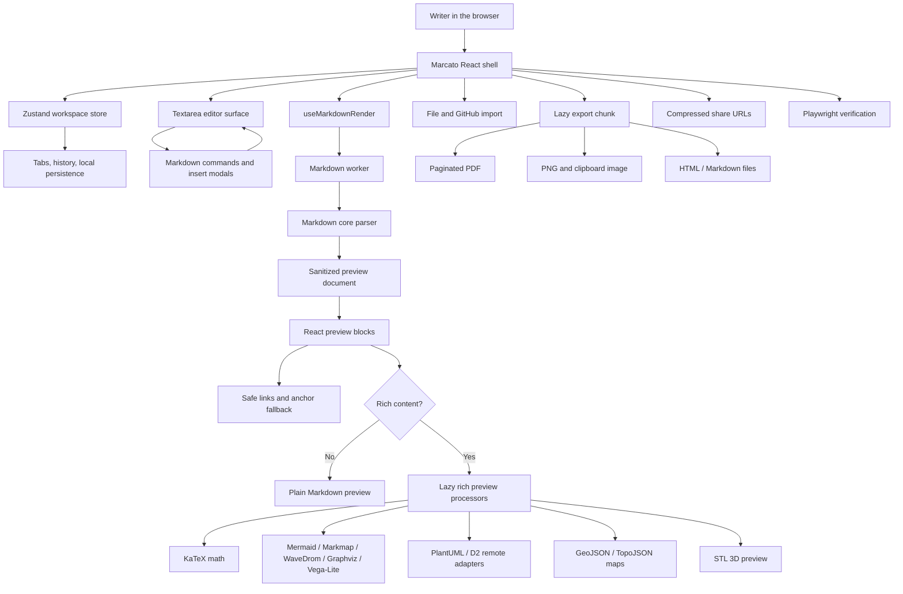

# Marcato

**A refined Markdown studio for writing, previewing, diagrams, sharing, and export.**

[English](README.md) | [简体中文](README.zh-CN.md) | [Español](README.es.md)

[](https://vercel.com/new/clone?repository-url=https%3A%2F%2Fgithub.com%2Ftianrking%2FMarcato&project-name=marcato&repository-name=Marcato)


Marcato is a browser-first Markdown workspace inspired by the original [`Markdown-Viewer`](https://github.com/ThisIs-Developer/Markdown-Viewer). It keeps the spirit of instant Markdown preview, then pushes the experience toward a modern React architecture: worker rendering, safer post-processing, rich diagrams, verified PDF export, share URLs, GitHub import, and performance tests that can run every time.

## Technical Stack

<table>
  <tr>
    <td><strong>UI</strong><br/>React 19, TypeScript, Zustand, lucide-react</td>
    <td><strong>Build</strong><br/>Vite 8, PWA service worker, Vercel-ready static output</td>
    <td><strong>Markdown</strong><br/>marked, DOMPurify, highlight.js, GitHub Markdown CSS</td>
  </tr>
  <tr>
    <td><strong>Math</strong><br/>KaTeX with safe preview post-processing</td>
    <td><strong>Diagrams</strong><br/>Mermaid, Markmap, WaveDrom, Graphviz, Vega-Lite, PlantUML, D2</td>
    <td><strong>Spatial / 3D</strong><br/>Leaflet, TopoJSON, Three.js, STL loader</td>
  </tr>
  <tr>
    <td><strong>Export</strong><br/>PDF, PNG, HTML, Markdown, clipboard image copy</td>
    <td><strong>Sharing</strong><br/>pako-compressed view/edit URLs</td>
    <td><strong>Verification</strong><br/>Playwright smoke, PDF, performance, and diagram suites</td>
  </tr>
</table>

## Architecture



## Features

- Multi-tab Markdown workspace with local persistence, rename, duplicate, close, reset, and per-tab undo/redo.
- Split, editor-only, and preview-only modes with draggable layout, line numbers, stats, outline, health checks, and synchronized scrolling.
- Worker-backed Markdown rendering with GFM, frontmatter tables, footnotes, definition lists, superscript, subscript, highlights, GitHub alerts, and sanitized HTML.
- Rich preview support for KaTeX, Mermaid, ABC notation, GeoJSON/TopoJSON, Graphviz, Vega-Lite, Markmap, WaveDrom, PlantUML, D2, and STL.
- Find/replace with regex, case, whole-word, selection scope, preview highlighting, and replace confirmation.
- Insert modals for links, images, references, tables, alerts, symbols, and GitHub emoji.
- Local file import, drag-and-drop import, GitHub repo/tree/blob/raw Markdown import, and offline-first persistence.
- Export to Markdown, HTML, PNG, clipboard image, and cancellable paginated PDF.
- Compressed share URLs with view-only/editable modes and long-link warnings.
- PWA app shell with slim precache for fast first load and update-friendly service worker headers.

## Verification

```bash
npm install
npm run lint
npm run build
npm test
```

Reusable browser suites live in `tests/e2e`:

- `npm run test:smoke`: editor, preview, modals, find, share, and mobile shell.
- `npm run test:pdf`: long tables, page breaks, diagrams, math, export progress, and cancellation.
- `npm run test:perf`: large documents and code-splitting proof for rich preview loading.
- `npm run test:diagrams`: local Markmap/WaveDrom plus remote PlantUML/D2 normalization, retry, and SVG sanitization.

## Development

```bash
npm run dev -- --host 127.0.0.1 --port 5173
```

Production output is static and Vercel-ready:

```bash
npm run build
npm run preview
```

## Deployment Notes

Marcato is a client-side app and can be deployed directly to Vercel with the button above. The Vercel configuration pins Node 20 and keeps `sw.js` / Workbox update-friendly with `Cache-Control: no-cache`. Runtime network access is only needed for GitHub import, remote diagram services, external map tiles, or external images referenced by the document.

## Tribute

Marcato intentionally acknowledges [`Markdown-Viewer`](https://github.com/ThisIs-Developer/Markdown-Viewer). That project proved how useful a focused browser Markdown viewer can be. Marcato is a modernized continuation of that idea with React, stronger verification, richer export, and a more product-shaped workflow.
