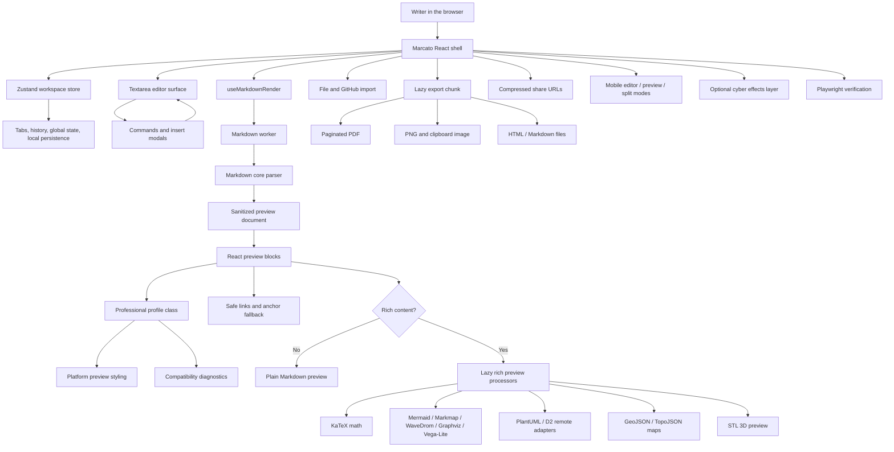

# Marcato

**A polished, browser-first Markdown studio for writing, professional preview profiles, diagrams, sharing, export, and mobile reading workflows.**

[English](README.md) | [Simplified Chinese](README.zh-CN.md) | [Espanol](README.es.md)

[](https://vercel.com/new/clone?repository-url=https%3A%2F%2Fgithub.com%2Ftianrking%2FMarcato&project-name=marcato&repository-name=Marcato)


Marcato is inspired by the original [`Markdown-Viewer`](https://github.com/ThisIs-Developer/Markdown-Viewer). It keeps the useful idea of instant browser Markdown preview, then expands it into a modern React workspace with worker rendering, rich diagrams, professional publication profiles, verified export, share URLs, GitHub import, mobile-first view modes, and reproducible browser tests.

## Screenshots

| Professional WeChat profile | Docusaurus docs profile |
| --- | --- |
|  |  |

| Mobile preview mode | Mobile split mode | Cyber effects |
| --- | --- | --- |
|  |  |  |

## What Marcato Does

<table>
  <tr>
    <td><strong>Write</strong><br/>Multi-tab Markdown editor, undo/redo history, line numbers, smart Enter, formatting commands, insert modals.</td>
    <td><strong>Preview</strong><br/>Worker-backed GFM preview with math, diagrams, sanitized HTML, find highlights, outline, and scroll sync.</td>
    <td><strong>Publish</strong><br/>Professional profiles for WeChat, GitHub, Docusaurus, VitePress, MkDocs, Hugo, Jekyll, and Astro.</td>
  </tr>
  <tr>
    <td><strong>Import</strong><br/>Local files, drag-and-drop, binary/size checks, GitHub repo/tree/blob/raw Markdown import.</td>
    <td><strong>Export</strong><br/>Markdown, HTML, PNG, clipboard image, and cancellable paginated PDF with progress.</td>
    <td><strong>Share</strong><br/>Compressed view-only and editable share URLs generated from the current origin.</td>
  </tr>
  <tr>
    <td><strong>Mobile</strong><br/>Editor-only, preview-only, and vertical split modes tuned for narrow screens.</td>
    <td><strong>Style</strong><br/>Light/dark themes, accent palettes, GitHub link, and optional cyber easter effects.</td>
    <td><strong>Trust</strong><br/>Unit tests plus Playwright smoke, PDF, performance, diagram, and mobile layout checks.</td>
  </tr>
</table>

## Modes

### Workspace View Modes

| Mode | Desktop behavior | Mobile behavior |
| --- | --- | --- |
| Editor | Editor fills the workspace. | Editor fills the web app workspace. No empty preview half. |
| Split | Side-by-side editor and preview, draggable divider. | Vertical editor/preview split for quick comparison. |
| Preview | Preview fills the workspace. | Preview becomes a page-sized reading surface. |

### Professional Profiles

Professional Mode is not just a placeholder. It changes the preview class, applies platform-oriented visual styling, persists the selected profile, and runs compatibility diagnostics.

| Profile | What it optimizes for | Current checks |
| --- | --- | --- |
| Standard | Full Marcato preview. | No platform restrictions. |
| WeChat Official Account | Narrow rich-text article canvas. | Frontmatter, math, tables, footnotes, raw HTML, remote images, diagrams, article length. |
| GitHub Markdown | README, issues, discussions, pull requests. | Marcato-only rich fences, Docusaurus/MkDocs syntax, frontmatter visibility, references. |
| Docusaurus / MDX | Docs pages and MDX authoring. | Frontmatter, `:::` admonitions, raw script/style, internal `.md` links. |
| VitePress | Vue-powered documentation. | Custom containers, frontmatter, internal links, React/JSX component mismatch. |
| Material for MkDocs | Python docs with Material conventions. | `!!!` admonitions, unsupported JSX/Vue, metadata caveats. |
| Hugo / Goldmark | Static blogs and content pages. | Frontmatter, raw HTML safety, shortcodes, foreign container syntax. |
| Jekyll / GitHub Pages | Blog-aware pages and posts. | YAML frontmatter, Liquid-vs-shortcode mismatch, foreign admonitions. |
| Astro / Starlight | Content collections and MDX docs. | Frontmatter, local image handling, MDX-style components, shortcode mismatch. |

### Visual Modes

- Light and dark themes.
- Accent palettes: blue, teal, violet, rose, amber.
- Optional Cyber Effects mode with matrix rain, scan beams, particles, lightning pulses, pointer glow, and a small animated pixel pet.
- Reduced-motion users are respected: the effect layer hides when the OS requests reduced motion.

## Markdown and Rich Blocks

| Area | Support |
| --- | --- |
| Core Markdown | GFM tables, task lists, strikethrough, autolinks, frontmatter table, footnotes, definition lists, superscript, subscript, highlights, GitHub alerts. |
| Code | highlight.js core with registered common languages, including JavaScript, TypeScript, Python, Rust, Go, Java, C/C++, C#, SQL, Bash, PowerShell, YAML, JSON, XML/HTML, CSS, PHP, Ruby, diff, and Markdown. |
| Math | KaTeX inline and block math post-processing. |
| Diagrams | Mermaid, ABC notation, GeoJSON, TopoJSON, STL, PlantUML, D2, Graphviz/DOT, Vega-Lite, WaveDrom, Markmap. |
| Diagram actions | Toolbar actions for copy/download SVG or PNG where supported, zoom modal paths, sanitization and clipboard fallbacks. |
| Safety | DOMPurify for main Markdown HTML, safe external-link handling, SVG sanitization paths, clipboard/download fallbacks. |

## Editing Tools

- Bold, italic, strike, headings H1-H6, quote, unordered/ordered/task lists, horizontal rule.
- Inline code, code block, terminal block, math block, date/time, upper/lower/title case.
- Link, image, reference, table, alert, symbol/entity, emoji, and diagram template modals.
- Find/replace with regex, case sensitivity, whole word, selection, preserve case, search history, preview highlights, and replace-all diff confirmation.
- Document health scoring with issue details and click-to-line navigation.

## Import, Export, Share

| Flow | Details |
| --- | --- |
| Local import | `.md`, `.markdown`, `.txt`; drag-and-drop overlay; binary detection; 10 MB import guard. |
| GitHub import | Repository, tree, blob, and raw URL import with selectable Markdown files. |
| Export | Markdown, HTML, PNG, clipboard PNG, and paginated PDF. |
| PDF | Progress UI, cancellation, page-break handling, table and rich-preview coverage in tests. |
| Share | `#share=` URLs compressed with pako; view-only and editable modes; long-link warning; current deployed origin is used. |
| PWA | Static app shell, Workbox service worker, no-cache service worker headers for reliable updates. |

## Architecture



## Technical Stack

<table>
  <tr>
    <td><strong>UI</strong><br/>React 19, TypeScript, Zustand, lucide-react</td>
    <td><strong>Build</strong><br/>Vite 8, Vercel static output, PWA service worker</td>
    <td><strong>Markdown</strong><br/>marked, DOMPurify, highlight.js, GitHub Markdown CSS</td>
  </tr>
  <tr>
    <td><strong>Math</strong><br/>KaTeX</td>
    <td><strong>Diagrams</strong><br/>Mermaid, Markmap, WaveDrom, Graphviz, Vega-Lite, PlantUML, D2, ABC</td>
    <td><strong>Spatial / 3D</strong><br/>Leaflet, TopoJSON, Three.js, STL loader</td>
  </tr>
  <tr>
    <td><strong>Export</strong><br/>jsPDF, html2canvas, file-saver, clipboard APIs</td>
    <td><strong>Sharing</strong><br/>pako-compressed URLs</td>
    <td><strong>Verification</strong><br/>Playwright, TypeScript, oxlint</td>
  </tr>
</table>

## Verification

```bash
npm install
npm run lint
npm run build
npm test
```

Reusable browser suites live in `tests/e2e`:

- `npm run test:smoke`: editor, preview, modals, find/replace, share URLs, mobile shell, and mobile view modes.
- `npm run test:pdf`: long tables, page breaks, diagrams, math, export progress, and cancellation.
- `npm run test:perf`: large documents and proof that rich preview processors are lazy-loaded.
- `npm run test:diagrams`: Markmap, WaveDrom, PlantUML, D2, retry behavior, and SVG sanitization.

Curated README screenshots are generated through browser checks and kept under `test-artifacts/`. Temporary logs and JSON reports stay ignored.

## Development

```bash
npm run dev -- --host 127.0.0.1 --port 5173
```

Production output is static and Vercel-ready:

```bash
npm run build
npm run preview
```

## Deployment Notes

Marcato is a client-side app and can be deployed directly to Vercel with the button above. The Vercel configuration pins Node 20 and keeps `sw.js` / Workbox update-friendly with `Cache-Control: no-cache`.

Runtime network access is only needed for GitHub import, remote diagram services, external map tiles, or external images referenced by the document. Normal editing and local preview stay in the browser.

## Current Boundaries

Professional profiles currently provide platform-oriented preview styling and diagnostics. They do not yet fully compile every platform-specific dialect into its native runtime output. The highest-value next adapters are WeChat rich-text copy with inline styles, real `:::` admonition rendering for Docusaurus/VitePress, and Material for MkDocs `!!!` admonition rendering.

## Tribute

Marcato intentionally acknowledges [`Markdown-Viewer`](https://github.com/ThisIs-Developer/Markdown-Viewer). That project proved how useful a focused browser Markdown viewer can be. Marcato continues that idea with a modern React codebase, stronger verification, richer export, professional preview profiles, and a product-shaped workflow.
