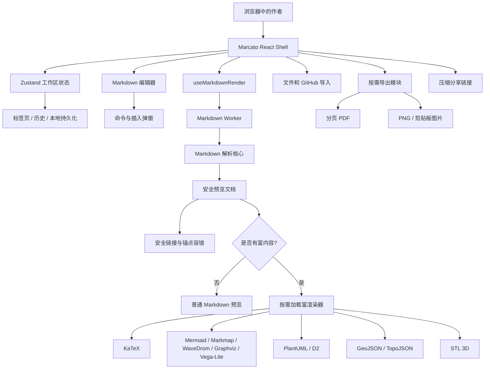

# Marcato

**一个更精致的 Markdown 写作、预览、图表、分享与导出工作台。**

[English](README.md) | [简体中文](README.zh-CN.md) | [Español](README.es.md)


Marcato 受到原版 [`Markdown-Viewer`](https://github.com/ThisIs-Developer/Markdown-Viewer) 启发：保留“打开就能写、立刻预览”的轻快体验，同时把它推进到更现代的 React 架构，补上 Worker 渲染、富图表、PDF 导出、分享链接、GitHub 导入和可重复跑的浏览器测试。

## 技术栈

<table>
  <tr>
    <td><strong>界面</strong><br/>React 19、TypeScript、Zustand、lucide-react</td>
    <td><strong>构建</strong><br/>Vite 8、PWA、Vercel 静态部署</td>
    <td><strong>Markdown</strong><br/>marked、DOMPurify、highlight.js、GitHub Markdown CSS</td>
  </tr>
  <tr>
    <td><strong>数学</strong><br/>KaTeX</td>
    <td><strong>图表</strong><br/>Mermaid、Markmap、WaveDrom、Graphviz、Vega-Lite、PlantUML、D2</td>
    <td><strong>地图 / 3D</strong><br/>Leaflet、TopoJSON、Three.js、STL loader</td>
  </tr>
  <tr>
    <td><strong>导出</strong><br/>PDF、PNG、HTML、Markdown、剪贴板图片</td>
    <td><strong>分享</strong><br/>pako 压缩 view/edit 链接</td>
    <td><strong>验证</strong><br/>Playwright smoke、PDF、性能、图表测试</td>
  </tr>
</table>

## 架构



## 当前功能

- 多标签 Markdown 工作区，本地保存、重命名、复制、关闭、重置、撤销/重做。
- 编辑 / 分屏 / 预览模式，拖拽分栏、行号、统计、目录、文档健康检查、同步滚动。
- Worker 渲染 Markdown，支持 GFM、frontmatter、脚注、定义列表、上下标、高亮、GitHub alerts 和 HTML 清洗。
- KaTeX、Mermaid、ABC、GeoJSON/TopoJSON、Graphviz、Vega-Lite、Markmap、WaveDrom、PlantUML、D2、STL。
- 查找替换：正则、大小写、整词、选区、预览高亮、替换确认。
- 链接、图片、引用、表格、提示块、符号、GitHub Emoji 插入弹窗。
- 本地文件导入、拖拽导入、GitHub 仓库/目录/blob/raw Markdown 导入。
- 导出 Markdown、HTML、PNG、预览图片、可取消分页 PDF。
- 压缩分享 URL，支持只读和可编辑模式。
- PWA app shell，首屏轻量预缓存，Service Worker 更新友好。

## 验证

```bash
npm install
npm run lint
npm run build
npm test
```

测试覆盖：

- `test:smoke`：编辑、预览、弹窗、查找、分享、移动端外壳。
- `test:pdf`：长表、分页、图表、数学、导出进度和取消。
- `test:perf`：大文档和富渲染按需加载。
- `test:diagrams`：本地 Markmap/WaveDrom，以及远程 PlantUML/D2 清洗、重试和安全校验。

## 致敬

Marcato 向 [`Markdown-Viewer`](https://github.com/ThisIs-Developer/Markdown-Viewer) 致敬。原项目证明了一个专注、直接、浏览器里的 Markdown Viewer 可以非常有价值；Marcato 继续这个方向，用 React、测试体系、性能拆分和更完整的产品工作流把它向前推进。
