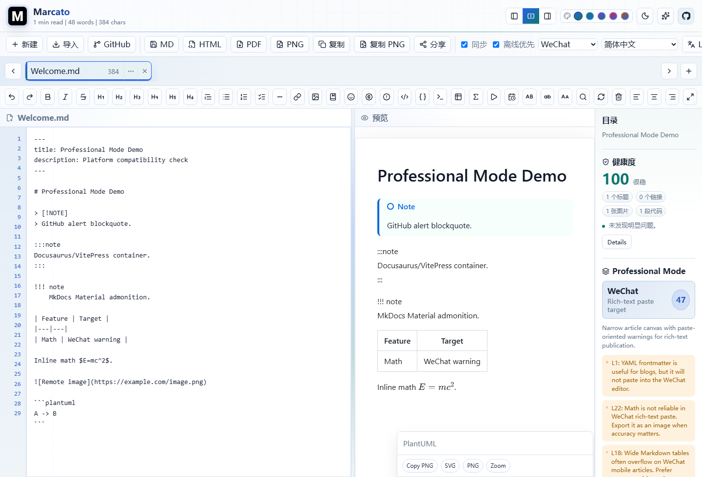
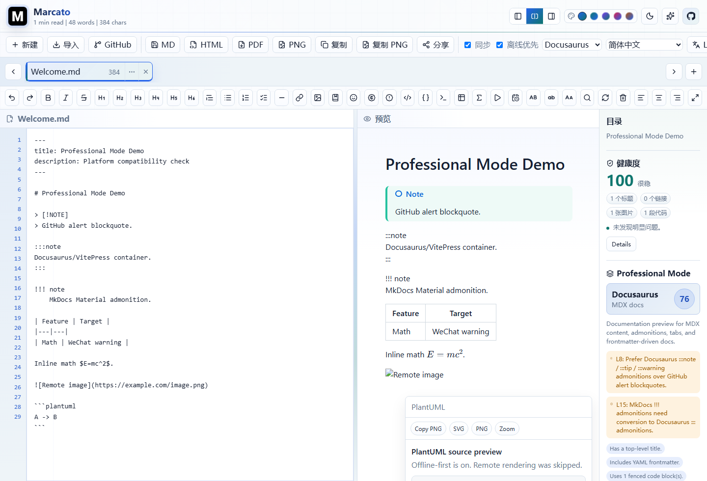
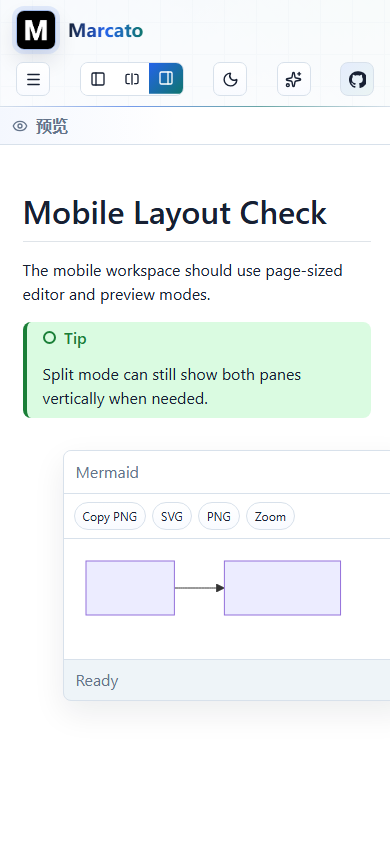
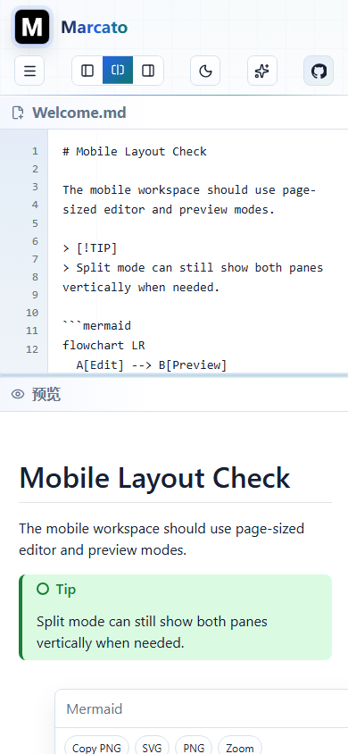
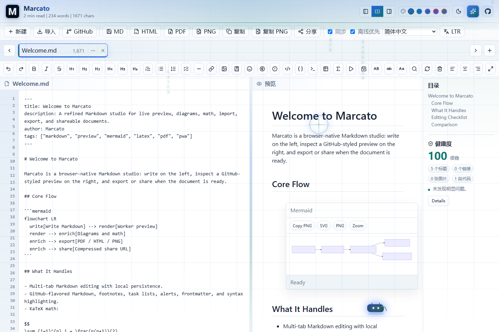
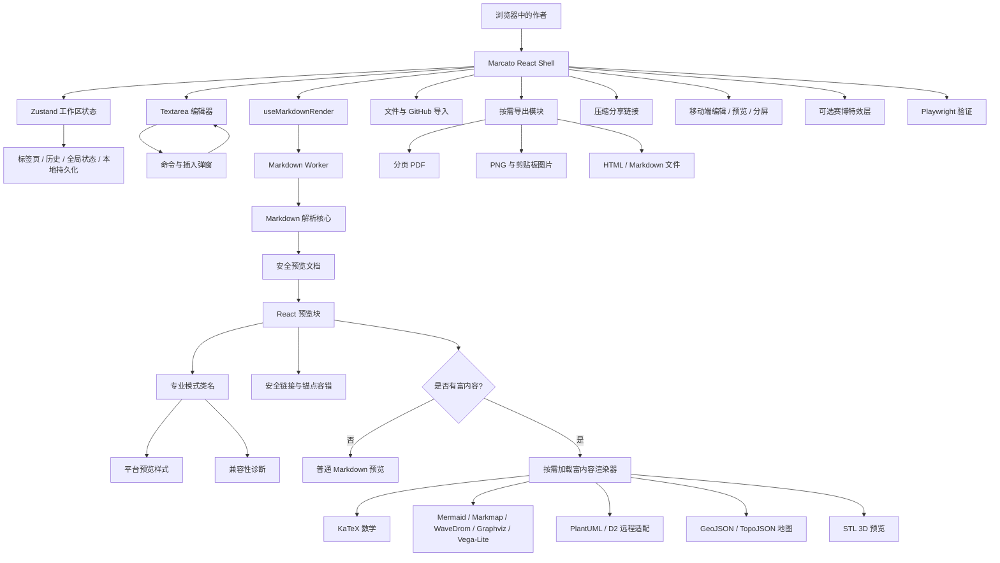

# Marcato

**一个面向浏览器的精致 Markdown 工作室：写作、专业预览模式、图表、分享、导出与移动端阅读体验。**

[English](README.md) | [简体中文](README.zh-CN.md) | [Español](README.es.md)

[](https://vercel.com/new/clone?repository-url=https%3A%2F%2Fgithub.com%2Ftianrking%2FMarcato&project-name=marcato&repository-name=Marcato)


Marcato 致敬并延续原版 [`Markdown-Viewer`](https://github.com/ThisIs-Developer/Markdown-Viewer) 的方向：保留“打开浏览器即可写 Markdown 并实时预览”的直接体验，同时升级为现代 React 工作区，加入 Worker 渲染、富图表、专业发布场景预览、可验证导出、分享链接、GitHub 导入、移动端专用视图和可重复运行的浏览器测试。

## 截图

| 微信公众号专业模式 | Docusaurus 文档模式 |
| --- | --- |
|  |  |

| 移动端预览模式 | 移动端上下分屏 | 赛博彩蛋 |
| --- | --- | --- |
|  |  |  |

## Marcato 能做什么

<table>
  <tr>
    <td><strong>写作</strong><br/>多标签 Markdown 编辑器、撤销/重做历史、行号、智能回车、格式化命令和插入弹窗。</td>
    <td><strong>预览</strong><br/>Worker 驱动的 GFM 预览，支持数学、图表、安全 HTML、查找高亮、目录和同步滚动。</td>
    <td><strong>发布</strong><br/>面向微信、GitHub、Docusaurus、VitePress、MkDocs、Hugo、Jekyll、Astro 的专业模式。</td>
  </tr>
  <tr>
    <td><strong>导入</strong><br/>本地文件、拖放导入、二进制/大小检查、GitHub repo/tree/blob/raw Markdown 导入。</td>
    <td><strong>导出</strong><br/>Markdown、HTML、PNG、剪贴板图片、带进度和取消能力的分页 PDF。</td>
    <td><strong>分享</strong><br/>基于当前访问地址生成压缩分享链接，支持只读和可编辑模式。</td>
  </tr>
  <tr>
    <td><strong>移动端</strong><br/>编辑全页、预览全页、上下分屏三种手机工作区模式。</td>
    <td><strong>视觉</strong><br/>亮/暗主题、强调色、GitHub 链接、可选赛博特效彩蛋。</td>
    <td><strong>可靠性</strong><br/>单元测试与 Playwright smoke、PDF、性能、图表、移动布局测试。</td>
  </tr>
</table>

## 模式

### 工作区视图模式

| 模式 | 桌面端 | 移动端 |
| --- | --- | --- |
| 编辑 | 编辑器占满工作区。 | 编辑器占满网页工作区，不再保留下半屏空白。 |
| 分屏 | 编辑器和预览左右并排，分隔条可拖拽。 | 编辑器和预览上下分屏，适合临时对照。 |
| 预览 | 预览占满工作区。 | 预览变成完整阅读页。 |

### 专业预览模式

专业模式不是空接口。它会切换预览类名、应用平台化视觉样式、持久化当前选择，并运行兼容性诊断。

| Profile | 面向场景 | 当前检查 |
| --- | --- | --- |
| Standard | Marcato 完整预览。 | 不启用平台限制。 |
| WeChat Official Account | 微信公众号富文本文章。 | frontmatter、数学、表格、脚注、HTML、远程图、图表、文章长度。 |
| GitHub Markdown | README、Issue、Discussion、Pull Request。 | Marcato 专属图表、Docusaurus/MkDocs 语法、frontmatter 显示、引用和 mention。 |
| Docusaurus / MDX | 文档站与 MDX。 | frontmatter、`:::` admonition、script/style、内部 `.md` 链接。 |
| VitePress | Vue 文档站。 | 自定义容器、frontmatter、内部链接、React/JSX 组件不兼容。 |
| Material for MkDocs | Python / Material 文档。 | `!!!` admonition、JSX/Vue 不兼容、metadata 注意事项。 |
| Hugo / Goldmark | 静态博客与内容页。 | frontmatter、raw HTML 安全、shortcode、外来容器语法。 |
| Jekyll / GitHub Pages | 博客文章和 GitHub Pages。 | YAML frontmatter、Liquid 与 shortcode 差异、外来 admonition。 |
| Astro / Starlight | 内容集合和 MDX 文档。 | frontmatter、本地图片路径、MDX 组件、shortcode 不兼容。 |

### 视觉模式

- 亮色 / 暗色主题。
- 强调色：blue、teal、violet、rose、amber。
- 可选 Cyber Effects：矩阵雨、扫描光束、粒子雨/雪、电光脉冲、鼠标光环和像素风小动物。
- 尊重系统减少动效设置：用户开启 reduced motion 时自动隐藏彩蛋层。

## Markdown 与富内容

| 模块 | 支持内容 |
| --- | --- |
| Markdown 核心 | GFM 表格、任务列表、删除线、自动链接、frontmatter 表格、脚注、定义列表、上标、下标、高亮、GitHub alerts。 |
| 代码 | highlight.js core 注册常用语言，包括 JS/TS、Python、Rust、Go、Java、C/C++、C#、SQL、Bash、PowerShell、YAML、JSON、XML/HTML、CSS、PHP、Ruby、diff、Markdown。 |
| 数学 | KaTeX 行内和块级数学。 |
| 图表 | Mermaid、ABC notation、GeoJSON、TopoJSON、STL、PlantUML、D2、Graphviz/DOT、Vega-Lite、WaveDrom、Markmap。 |
| 图表操作 | 支持复制/下载 SVG 或 PNG、缩放查看、SVG 清洗与剪贴板降级路径。 |
| 安全 | 主 Markdown HTML 走 DOMPurify，外链安全处理，SVG 清洗，剪贴板失败时降级下载。 |

## 编辑工具

- 加粗、斜体、删除线、H1-H6、引用、无序/有序/任务列表、水平线。
- 行内代码、代码块、终端块、数学、日期时间、大写/小写/标题大小写。
- 链接、图片、引用、表格、alert、符号/HTML entity、emoji、图表模板弹窗。
- 查找替换：正则、大小写、整词、选区、保留大小写、历史、预览高亮、替换全部 diff 确认。
- 文档健康评分、详情弹窗、点击问题跳转对应行。

## 导入、导出、分享

| 流程 | 说明 |
| --- | --- |
| 本地导入 | `.md`、`.markdown`、`.txt`；拖放覆盖层；二进制检测；10 MB 限制。 |
| GitHub 导入 | 支持 repository、tree、blob、raw URL，并可选择 Markdown 文件。 |
| 导出 | Markdown、HTML、PNG、剪贴板 PNG、分页 PDF。 |
| PDF | 进度 UI、取消、分页、表格和富预览测试覆盖。 |
| 分享 | pako 压缩 `#share=` URL，只读/可编辑模式，长链接提示，使用当前部署地址。 |
| PWA | 静态 app shell，Workbox service worker，service worker no-cache 便于更新。 |

## 架构



## 技术栈

<table>
  <tr>
    <td><strong>UI</strong><br/>React 19、TypeScript、Zustand、lucide-react</td>
    <td><strong>构建</strong><br/>Vite 8、Vercel 静态输出、PWA service worker</td>
    <td><strong>Markdown</strong><br/>marked、DOMPurify、highlight.js、GitHub Markdown CSS</td>
  </tr>
  <tr>
    <td><strong>数学</strong><br/>KaTeX</td>
    <td><strong>图表</strong><br/>Mermaid、Markmap、WaveDrom、Graphviz、Vega-Lite、PlantUML、D2、ABC</td>
    <td><strong>地图 / 3D</strong><br/>Leaflet、TopoJSON、Three.js、STL loader</td>
  </tr>
  <tr>
    <td><strong>导出</strong><br/>jsPDF、html2canvas、file-saver、Clipboard APIs</td>
    <td><strong>分享</strong><br/>pako 压缩链接</td>
    <td><strong>验证</strong><br/>Playwright、TypeScript、oxlint</td>
  </tr>
</table>

## 验证

```bash
npm install
npm run lint
npm run build
npm test
```

可复用浏览器测试位于 `tests/e2e`：

- `npm run test:smoke`：编辑、预览、弹窗、查找替换、分享链接、移动端外壳和移动端视图模式。
- `npm run test:pdf`：长表格、分页、图表、数学、导出进度和取消。
- `npm run test:perf`：大文档和富内容渲染器按需加载。
- `npm run test:diagrams`：Markmap、WaveDrom、PlantUML、D2、重试行为和 SVG 清洗。

README 中的精选截图来自浏览器验证流程，保存在 `test-artifacts/`。临时日志和 JSON 报告仍保持忽略。

## 开发

```bash
npm run dev -- --host 127.0.0.1 --port 5173
```

生产构建是纯静态输出，适合 Vercel：

```bash
npm run build
npm run preview
```

## 部署说明

Marcato 是纯客户端应用，可直接使用上方 Vercel 按钮部署。`vercel.json` 固定 Node 20，并让 `sw.js` / Workbox 使用 `Cache-Control: no-cache`，保证 PWA 更新更及时。

只有 GitHub 导入、远程图表服务、外部地图瓦片或文档中引用的外部图片需要网络。普通编辑和本地预览都在浏览器内完成。

## 当前边界

专业模式当前提供平台化预览样式和兼容性诊断，还不是每个平台原生运行时的完整编译器。下一批最有价值的是：微信公众号富文本复制与内联样式 HTML、Docusaurus/VitePress 的 `:::` admonition 真实渲染、Material for MkDocs 的 `!!!` admonition 渲染。

## 致敬

Marcato 明确致敬 [`Markdown-Viewer`](https://github.com/ThisIs-Developer/Markdown-Viewer)。原项目证明了一个专注、直接、运行在浏览器中的 Markdown Viewer 很有价值。Marcato 在这个方向上继续前进，用现代 React 架构、测试体系、富导出、专业预览模式和更完整的产品工作流把体验推进一步。
