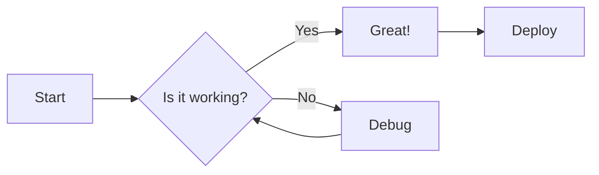
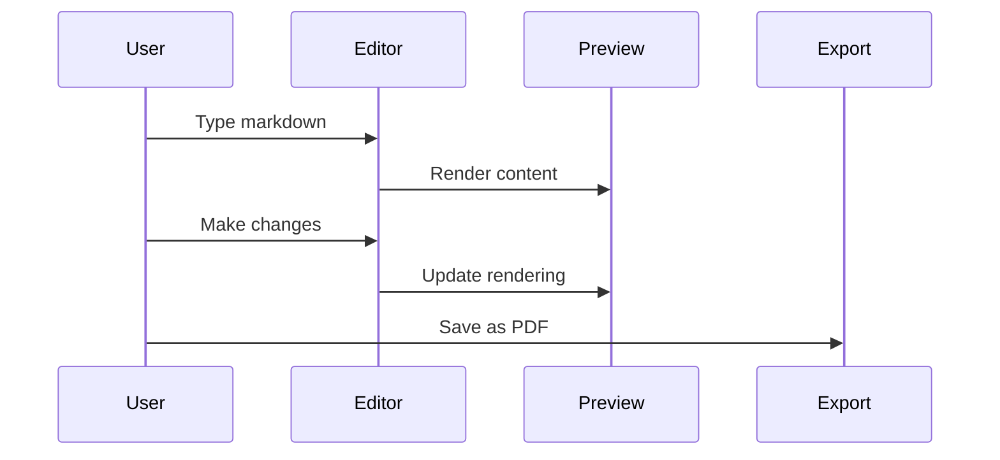

# Welcome to Markdown Viewer

## ✨ Key Features
- **Live Preview** with GitHub styling
- **Smart Import/Export** (MD, HTML, PDF)
- **Mermaid Diagrams** for visual documentation
- **LaTeX Math Support** for scientific notation
- **Emoji Support** 😄 👍 🎉

## 💻 Code with Syntax Highlighting
```javascript
  function renderMarkdown() {
    const markdown = markdownEditor.value;
    const html = marked.parse(markdown);
    const sanitizedHtml = DOMPurify.sanitize(html);
    markdownPreview.innerHTML = sanitizedHtml;
    
    // Syntax highlighting is handled automatically
    // during the parsing phase by the marked renderer.
    // Themes are applied instantly via CSS variables.
  }
```

## 🧮 Mathematical Expressions
Write complex formulas with LaTeX syntax:

Inline equation: $$E = mc^2$$

Display equations:
$$\\frac{\\partial f}{\\partial x} = \\lim_{h \\to 0} \\frac{f(x+h) - f(x)}{h}$$

$$\\sum_{i=1}^{n} i^2 = \\frac{n(n+1)(2n+1)}{6}$$

## 📊 Mermaid Diagrams
Create powerful visualizations directly in markdown:



### Sequence Diagram Example


## 📋 Task Management
- [x] Create responsive layout
- [x] Implement live preview with GitHub styling
- [x] Add syntax highlighting for code blocks
- [x] Support math expressions with LaTeX
- [x] Enable mermaid diagrams

## 🆚 Feature Comparison

| Feature                  | Markdown Viewer (Ours) | Other Markdown Editors  |
|:-------------------------|:----------------------:|:-----------------------:|
| Live Preview             | ✅ GitHub-Styled       | ✅                     |
| Sync Scrolling           | ✅ Two-way             | 🔄 Partial/None        |
| Mermaid Support          | ✅                     | ❌/Limited             |
| LaTeX Math Rendering     | ✅                     | ❌/Limited             |

### 📝 Multi-row Headers Support

<table>
  <thead>
    <tr>
      <th rowspan="2">Document Type</th>
      <th colspan="2">Support</th>
    </tr>
    <tr>
      <th>Markdown Viewer (Ours)</th>
      <th>Other Markdown Editors</th>
    </tr>
  </thead>
  <tbody>
    <tr>
      <td>Technical Docs</td>
      <td>Full + Diagrams</td>
      <td>Limited/Basic</td>
    </tr>
    <tr>
      <td>Research Notes</td>
      <td>Full + Math</td>
      <td>Partial</td>
    </tr>
    <tr>
      <td>Developer Guides</td>
      <td>Full + Export Options</td>
      <td>Basic</td>
    </tr>
  </tbody>
</table>

## 📝 Text Formatting Examples

### Text Formatting

Text can be formatted in various ways for ~~strikethrough~~, **bold**, *italic*, or ***bold italic***.

For highlighting important information, use <mark>highlighted text</mark> or add <u>underlines</u> where appropriate.

### Superscript and Subscript

Chemical formulas: H<sub>2</sub>O, CO<sub>2</sub>  
Mathematical notation: x<sup>2</sup>, e<sup>iπ</sup>

### Keyboard Keys

Press <kbd>Ctrl</kbd> + <kbd>B</kbd> for bold text.

### Abbreviations

<abbr title="Graphical User Interface">GUI</abbr>  
<abbr title="Application Programming Interface">API</abbr>

### Text Alignment

<div style="text-align: center">
Centered text for headings or important notices
</div>

<div style="text-align: right">
Right-aligned text (for dates, signatures, etc.)
</div>

### **Lists**

Create bullet points:
* Item 1
* Item 2
  * Nested item
    * Nested further

### **Links and Images**

Add a [link](https://github.com/ThisIs-Developer/Markdown-Viewer) to important resources.

Embed an image:


### **Blockquotes**

Quote someone famous:
> "The best way to predict the future is to invent it." - Alan Kay

---

## 🛡️ Security Note

This is a fully client-side application. Your content never leaves your browser and stays secure on your device.
