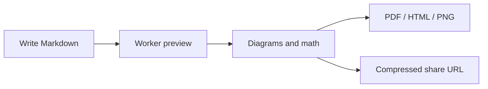

# Welcome to Marcato

Marcato is a browser-native Markdown studio: write on the left, inspect a GitHub-styled preview on the right, and export or share when the document is ready.

## Core Flow

## What It Handles

- Multi-tab Markdown editing with local persistence.
- GitHub-flavored Markdown, footnotes, task lists, alerts, frontmatter, and syntax highlighting.
- KaTeX math:

$$
\sum_{i=1}^{n} i = \frac{n(n+1)}{2}
$$

- Mermaid, Markmap, WaveDrom, PlantUML, D2, Graphviz, Vega-Lite, GeoJSON/TopoJSON, ABC notation, and STL previews.
- PDF export with progress, cancellation, pagination, table handling, and visual layout checks.

## Editing Checklist

- [x] Draft locally
- [x] Preview safely
- [x] Export when ready
- [ ] Share the polished version

## Comparison

| Capability | Marcato | Plain editors |
| --- | --- | --- |
| Live split preview | Full | Mixed |
| Diagram rendering | Local-first plus remote adapters | Usually limited |
| PDF workflow | Paginated, cancellable, tested | Often browser print only |
| Share URLs | Compressed view/edit modes | Rare |

> Marcato is fully client-side. Your document stays in your browser unless you intentionally import from GitHub, render through a remote diagram service, or share a URL.
